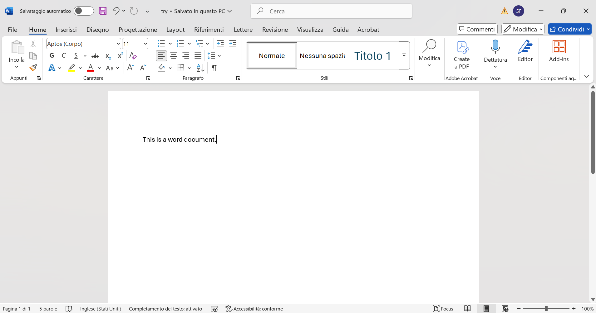
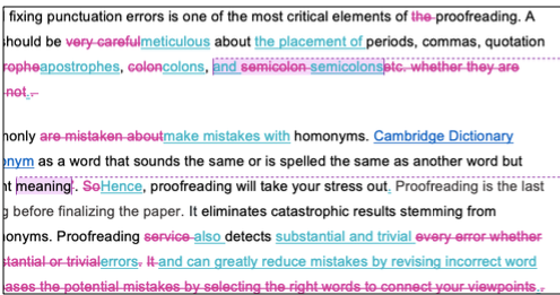

---
# You can also start simply with 'default'
theme: default
# random image from a curated Unsplash collection by Anthony
# like them? see https://unsplash.com/collections/94734566/slidev
# background: https://cover.sli.dev
# some information about your slides (markdown enabled)
title: Decoding Your Science Presentation
info: |
  ## Slidev Starter Template
  Presentation slides for developers.

  Learn more at [Sli.dev](https://sli.dev)
# apply unocss classes to the current slide
class: text-center
# https://sli.dev/features/drawing
drawings:
  persist: false
# slide transition: https://sli.dev/guide/animations.html#slide-transitions
transition: slide-left
# enable MDC Syntax: https://sli.dev/features/mdc
mdc: true
# open graph
# seoMeta:
#  ogImage: https://cover.sli.dev
---

  <!-- Left column -->
  

    <h1 class="text-3xl font-bold mb-2">The golden shackles of Microsoft Word</h1>
    
How convenience hinders scientific production.

    

      Giacomo Fantoni
    

  

  <!-- Right column -->
  

    
  

<!--
Because noone has taught us there are other solution and we don't want to loose time by learning by ourselve we choose the most "convenient" solution, the program that's already there thanks to a clever marketing strategy by microsoft.
-->
---
layout: default
class: image-slide
---
# A single program doing three jobs (badly) - Visualization

<!-- test -->

---
layout: image-left

image: visualization_logos.jpg

class: my-cool-content-on-the-right object-contain
backgroundSize: contain
---

- Open Standards.
- Free software available.
- Non Modifiable.
- Visualization is consistent in every device.
- Everyone shares everything this way.

---
layout: default
class: image-slide
---
# A single program doing three jobs (badly) - Writing

<!-- test -->

---
layout: image-left

image: writing_example.jpg

class: my-cool-content-on-the-right object-contain
backgroundSize: contain
---

- Open Standards.
- YOU choose how to write it.
- Free software available.
- Good documentation.
- Easily searchable.

---
layout: default
class: !pt-8 !pb-4
---
# A single program doing three jobs (badly) - Collaboration

  
  

---
layout: default
class: !pt-8 !pb-4
---

  
  

---
layout: image
image: ./plato-allegory-of-the-cave_edited.png
---
  

    
    
Link to the source code for the slides

  

<!-- test -->
