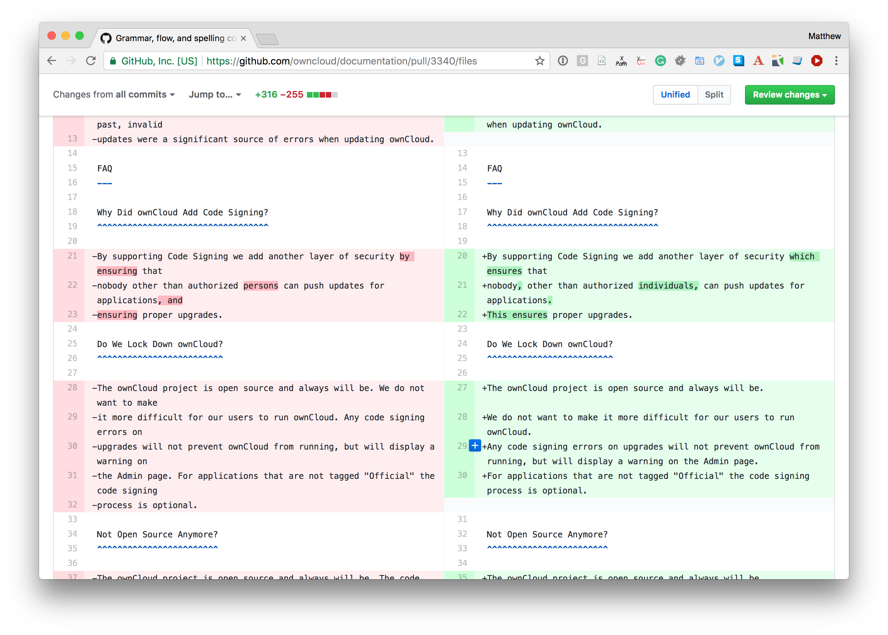

---
# You can also start simply with 'default'
theme: default
# random image from a curated Unsplash collection by Anthony
# like them? see https://unsplash.com/collections/94734566/slidev
# background: https://cover.sli.dev
# some information about your slides (markdown enabled)
title: Decoding Your Science Presentation
info: |
  ## Slidev Starter Template
  Presentation slides for developers.

  Learn more at [Sli.dev](https://sli.dev)
# apply unocss classes to the current slide
class: text-center
# https://sli.dev/features/drawing
drawings:
  persist: false
# slide transition: https://sli.dev/guide/animations.html#slide-transitions
transition: slide-left
# enable MDC Syntax: https://sli.dev/features/mdc
mdc: true
# open graph
# seoMeta:
#  ogImage: https://cover.sli.dev
---

  <!-- Left column -->
  

    <h1 class="text-3xl font-bold mb-2">The golden shackles of Microsoft Word</h1>
    
How convenience hinders scientific production.

    

      Giacomo Fantoni
    

  

  

    
  

<!--
The crowining achievement of every scientific project is the publication in a scientific journal, but we as scientists seldom pay attention to the tools we use to write those papers.
Because of this we make the most convenient choise and write it using microsoft Word, which is one of the most mediocre pieces of software to do so.
The problem of Words, beside cost and the fact that is developed by an evil corporation is that it tries to do everything and in doing so, does everything badly.
Today I want to discuss with you the tree major Word use cases, why it sucks at doing it and what can we use it instead.
-->
---
layout: default
class: image-slide
---
# A single program doing two jobs (badly) - Visualization

<!--This is a pretty simple word document. It looks pretty right? That's because Word is, as you are writing a document showing you how it should look. But: it often breaks the visualization between different version, it becomes laggy on large document and while scrolling you are always at risk of touching one of those pretty buttons and make changes to a document your are currently only reading.-->

---
layout: default
class: image-slide
---
# A single program doing two jobs (badly) - Writing

<!--Remember the document I showed you earlier? This is how it is saved on your computer. Because word is not only a writing software but also a visualization software it needs to store a lot of information in its files, which then needs to translate it to make it readable to you.
This typesetting information is just a distraction: you are writing the paper, not publishing it, you should not need to be worried on how things are visualized on a page, that's the job of the publisher, buy just on the content.
-->

---
layout: center
---
# The better alternative: Plain Text

  
  
➡️

  

<!-- To solve these problem we should decouple visualization from editing and use, when reading open standard that are used just for visualization and nothing else, like pdfs (portable document format) or web interfaces.
These are open format that are only use for visualization, so there is no risk for modification and the content is guaranteed to stay the same across devices, or even to be adaptive to the form factor of the device you are visualizing the document in.
To solve this problem we should switch to a plain text format like Markdown, where you don't pick a specific font or need to specify the exact position of an element in a page.
You just use special character to identify elements like headers, lists or bold text and let the typesetting be handled by an automatic software.
All the journal support this paradigm and provide you with all the typesetting specification, so if you decide to change journal midway your writing you don't need to change anything in your document, just the typesetting rules of the compiler you are using. -->

---
layout: default
class: !pt-8 !pb-4
---
# Collaboration

  
  

<!-- The last thing I want to talk about is collaboration.
Everyone in this room has been in this position, when you start piling up different versions of the same document as separate files, usually by naming it with the date of the last modification.
This is a nightmare to do, and I often found myself loosing content and having to go through every file to find it again.
This gets amplified with multiple people are working on the document and different versions get scattered in multiple mail threads which then you need to start looking at.
Also track changes are a nightmare and make it very difficult to visualize how the document should look like and what are the changes done to it.-->

---
layout: default
class: !pt-8 !pb-4
---
# Version Control

  
  

<!--This problem does not exist in plain text land as one can easily use version control software like git.
The versions stop beeing a bunch of scattered files but become these nodes in a single place, with well documented and easy methods to navigate between them.
Every change is added as a node in the tree and comparison between versions can be visualized in such a nicer way with this type of view, which to me is much clearer than track changes.-->
---
layout: image
image: ./plato-allegory-of-the-cave_edited.png
---
  

    
    
Link to the source code for the slides

  

<!--So please leave the cave of Microsoft and join us in the light of plain text. -->
